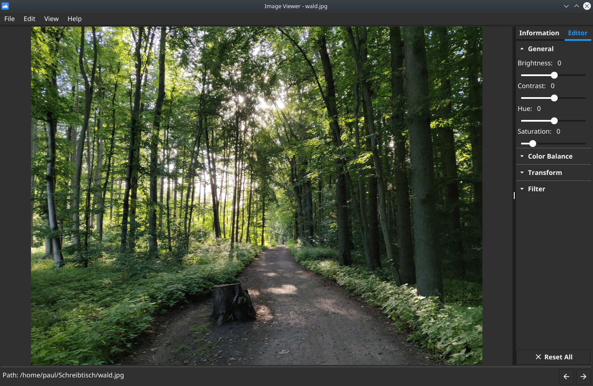

 

# Image Viewer 

## Screenshot



## Used Tools

- language: Go
- UI framework: fyne
- image processing backend: gift
- cross compilation: fyne-cross

## Installation

Packages are currently available for Windows, macOS and Linux.
On Windows and macOS, just download the packages from the [releases section](https://github.com/Palexer/image-viewer/releases)
and install it as usual. 

*Note for Mac users: There might be a warning, that the OS doesn't trust the application. In this case press Ctrl+left click on the
application and select open. Next time the app should open like any other program.

On Linux you'll need download the package from the [releases section](https://github.com/Palexer/image-viewer/releases) too.
Then extract the archive.
To install type (in the folder that contains the Makefile):

``` bash
sudo make install
```

To uninstall type:
``` bash
sudo make uninstall
```

## Contributing

1. Fork this repository to your local machine
2. Add a new branch, make changes, merge to master branch
3. Make a pull request

## ToDo

- undo/redo: change parameter values
- open recent images

## License

[MIT](LICENSE)
