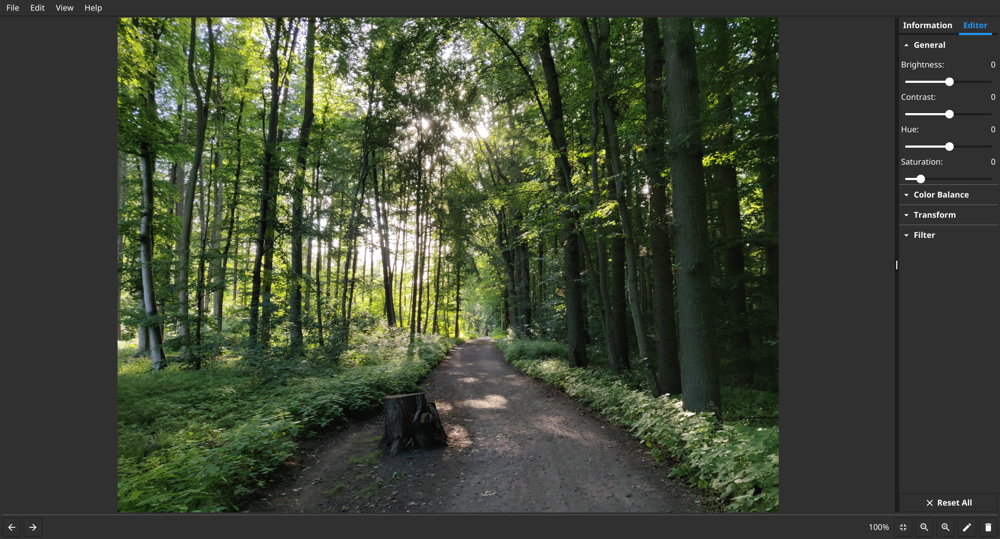

 

# Image Viewer 

## Screenshot

## Used Tools

- language: Go
- UI framework: fyne
- image processing backend: gift
- cross compilation: fyne-cross

## ToDo

- undo/redo: change parameter values
- fix open recent dialog to open correct images
- delete/copy images
- shortcuts for back/forward withouth modkey

## License

[MIT](LICENSE)
